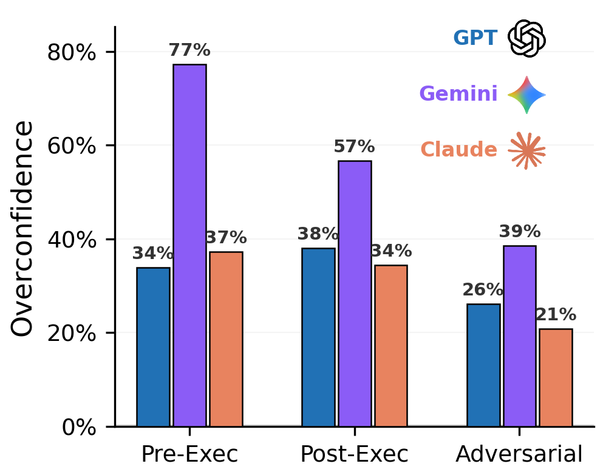

# Agentic Uncertainty Reveals Agentic Overconfidence

<p align="center">
  
</p>

**[Link to Paper](https://arxiv.org/abs/2602.06948)**.

This repository reproduces our SWE-bench Pro experiments on:
- Pre-execution uncertainty (`exploration`)
- Post-execution uncertainty (`review`)
- Mid-execution uncertainty traces (`mid_execution`)

## Quick Start

From this directory:

```bash
cd agentic_uncertainty
./install.sh
```

Then set credentials:

```bash
cp .env.example .env
# edit .env and set the keys you need (see below)
```

Required in practice:
- Model API credentials (for the model you run)
- Modal credentials (`MODAL_TOKEN_ID`, `MODAL_TOKEN_SECRET`, or `modal setup`)

## Reproduce Experiments

Use the unified runner script:

```bash
bash agentic_uncertainty/run_experiments.sh
```


## Generate Tables and Figures

```bash
uv run generate-tables --results-dir results --output results/tables
uv run generate-paper-figures --cache-dir cache --ground-truth-dir data/trajectories --output-dir paper/figures
```

For mid-execution analysis:

```bash
uv run python -m agentic_uncertainty.scripts.analysis.analyze_mid_execution \
  --cache-dir cache \
  --ground-truth-dir data/trajectories \
  --output-dir results/mid_execution_analysis \
  --plots --latex
```


## Citation

```bibtex
@misc{kaddour2026agenticuncertaintyrevealsagentic,
  title={Agentic Uncertainty Reveals Agentic Overconfidence},
  author={Jean Kaddour and Srijan Patel and Gb\u00e8tondji Dovonon and Leo Richter and Pasquale Minervini and Matt J. Kusner},
  year={2026},
  eprint={2602.06948},
  archivePrefix={arXiv},
  primaryClass={cs.AI},
  url={https://arxiv.org/abs/2602.06948},
}
```
